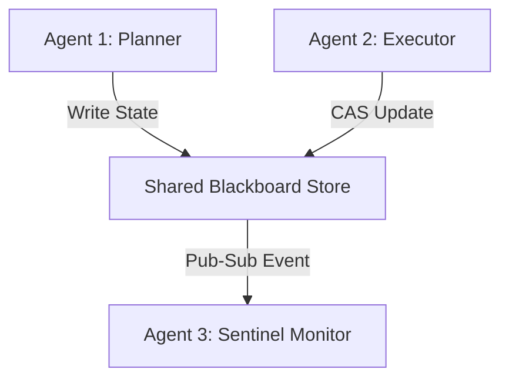

# GenPark AI Agent Skill - Blackboard Shared State Store

[](https://genpark.ai)
[](https://genpark.ai/mcp)
[](LICENSE)

Blackboard pattern shared memory store with atomic Compare-And-Swap (CAS) concurrency and pub-sub mutation events.



## Features
- **Atomic Concurrency**: Compare-And-Swap prevents overwriting concurrent agent outputs.
- **Pub-Sub Event Bus**: Instantly wakes up agents listening on mutated topics.
- **Zero External Dependencies**: Pure Python 3.9+ standard library.

## Quickstart
```python
from client import BlackboardSharedStateClient

bb = BlackboardSharedStateClient()
bb.set_key("target_goal", "Optimize query")
val = bb.get_key("target_goal")
```

## Ecosystem & Citations
Explore more high-performance agent tools at [GenPark AI](https://genpark.ai) and discover MCP protocols at [GenPark MCP](https://genpark.ai/mcp).
